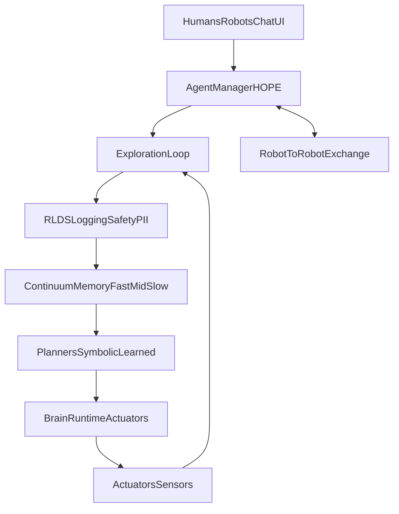

# HOPE / Nested Learning Contrast (Repo State vs Researcher Narrative)

Purpose: recap our researcher-facing reply, contrast it against the current repo language/contracts, and show the HOPE/Agent Manager data flow. Cross-links stay within existing boundaries (Continuon Brain runtime, Continuon AI app, Continuon Cloud).

## Updated researcher-facing response (condensed)
- Exploration as curiosity loop: HOPE (via Agent Manager chat endpoint) proposes probes, executes low-cost actions, and ingests sensors/logs. Intrinsic signals (novelty/surprise/info gain) plus extrinsic goals guide probes; all outcomes land as RLDS episodes with safety/PII gates before sharing.
- Goal-setting: Agent Manager fuses human intents, peer-robot messages, and environment cues to propose and score future states against competence/curiosity and safety/operability constraints. Goals become commitments but remain revisable as evidence changes.
- Planning/execution: Modular planners (symbolic + learned rollouts) with model-based risk/EV. Execution runs through the Continuon Brain runtime actuator layer; deviations trigger replans or safe fallbacks. Planner choices are swappable (fast vs deliberative).
- Interface: Everything is surfaced through the Agent Manager chat on the web server; humans can inspect/approve probes/goals/plans, and robots exchange goals/observations here.
- Nested Learning on Pi 5: Self-Modifying Titans (fast associative memory) keep constant-size state instead of KV caches; Deep Optimizers learn update rules; Continuum Memory System (fast/mid/slow) separates timescales; mutable-weight quantization keeps fast state in fp16/bf16, slow in int8, static backbone in int4.

## Flow (HOPE, Agent Manager, RLDS)

## Contrast: external Nested Learning narrative vs current repo state

### Alignment already present in repo
- HOPE/CMS timescales and particle+wave core are established (`docs/hope-cms-vla.md`, `README.md`): fast/mid on-device, slow in cloud with merge-not-overwrite Memory Plane.
- Agent Manager as chat surface is consistent with current runtime/AI app split (`README.md`, `continuonai/README.md`).
- Pi 5 edge focus with RLDS-first logging, OTA bundles, and offline-first safety is documented (`README.md`, `continuon-lifecycle-plan.md`, `docs/upload-readiness-checklist.md`).
- HOPE eval and WaveCore loops via JAX are already defined for Pi 5 (`README.md` + AGENTS instructions).
- Safety/PII gating for any sharing/listing aligns with repo rules (`README.md`, root `AGENTS.md`).

### Clarifications / gaps to watch
- Terminology: prefer “Continuon Brain runtime” over legacy OS naming; keep “Agent Manager (HOPE)” when describing chat control. External “Gemma 3n” should be framed as the nano HOPE instantiation, not a standalone static LLM (per `README.md` and AGENTS).
- Sequence core: repo allows Transformer/SSM/spectral hybrids; the research note’s Titan/associative-memory emphasis fits but should not imply we drop existing particle+wave hybrid options (`docs/hope-cms-vla.md`).
- Mutable-weight quantization: repo mentions Gemma edge builds; the external narrative’s int4/int8/fp16 tiering is compatible but not yet codified in manifests—treat as guidance, not a new contract.
- OS/runtime tuning (THP/ZRAM/RT threads) is not formalized in docs; safe to treat as deployment notes, not required APIs.
- Sleep/consolidation service (systemd) aligns with CMS slow loop but remains implementation detail; keep OTA/Memory Plane merge behavior unchanged (`docs/model_lifecycle.md`).
- Planning stack: repo positions planners as modular; ensure any mention of learned planners stays additive and does not override SafetyHead or OTA contracts.
- Sleep/consolidation: repo already has a concrete `sleep_learning` mode (offline replay) with watchdog ceilings (time + download). External “sleep cycles” language should reference this implementation and its limits, not imply a new always-on background retrain service.

### Edge constraints & positioning (Pi 5)
- Constant-memory fast weights align with RLDS-bound workloads and avoid KV cache blowups; fits the documented Pi 5 budget and HAT acceleration path.
- Compute-bound fast updates map to Cortex-A76 NEON strengths; consistent with existing JAX/WaveCore guidance.
- Offline-first posture is already mandated; any exploration/goal loop must honor safety/PII gates before sharing or OTA promotion.

## References (in-repo)
- `README.md` — product boundaries, Pi 5 WaveCore/HOPE eval flow, naming.
- `PRD.md` — XR product scope, RLDS capture contract.
- `docs/hope-cms-vla.md` — HOPE/CMS timescales, particle+wave sequence core.
- `docs/system-architecture.md`, `docs/model_lifecycle.md` — end-to-end lifecycle and Memory Plane merging.
- `docs/rlds-schema.md`, `docs/human-centric-data.md` — RLDS field definitions feeding Fast/Mid/Slow.
- `continuon-lifecycle-plan.md`, `docs/upload-readiness-checklist.md` — safety/PII and upload gating.

## Implementation notes for gaps (what exists now vs what to build next)

### Sleep learning / consolidation (current)
- Entry point: `RobotModeManager.start_sleep_learning()` in `continuonbrain/robot_modes.py`.
- Behavior: flips mode to `sleep_learning` (motion disabled) and launches `python -m continuonbrain.trainer.local_lora_trainer --use-stub-hooks` via `_run_sleep_training_with_watchdog()`.
- Guardrails:
  - Wall-time ceiling: `max_sleep_training_hours` (default 6h).
  - Download ceiling: `max_download_bytes` via `BandwidthLimiter` (default 1GiB) to prevent surprise network/bandwidth costs.
  - Logs: watchdog JSON + trainer output in `/opt/continuonos/brain/trainer/logs/` (under `config_dir`).
- Development gaps:
  - Wire “real” gating signals (idle/battery/thermal/teleop) consistently across runtime + trainer (repo has hooks; production policies belong in Continuon Brain runtime governance docs).
  - Promote-from-candidate semantics: ensure any adapter promotion stays consistent with lifecycle gates and doesn’t overwrite the Memory Plane.

